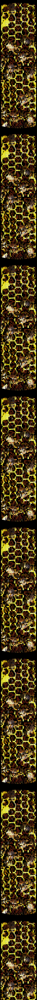

<table align="center"><tr>
<td valign="top" width="120"></td>
<td valign="top">

countries, dogma, illogical judgment, the default render of reality... none of it is real. mostly questions. some code. learning out loud. <i>particles · hives · cosmos · the chaos we're in.</i>

 

  

 

<code>+ reverse-engineering · sec · game-modding</code>

 

  

 

 

<table><tr>
<td align="center"><a href="https://music.youtube.com/playlist?list=PLvwLHgkB3k2HvjDlyNGkPk59j-7FIo2ou"> одиночество</a></td>
<td align="center"><a href="https://music.youtube.com/playlist?list=PLvwLHgkB3k2FP425gSzx7o6BlEQ3T9sLm"> MacroBlank</a></td>
<td align="center"><a href="https://music.youtube.com/playlist?list=PLvwLHgkB3k2EAYB-X6f59dXzzdBxEvEwg"> coding music</a></td>
</tr><tr>
<td align="center"><a href="https://music.youtube.com/playlist?list=PLvwLHgkB3k2HItVmSzrbI_8jhCkPqzvDn"> experimental hiphop</a></td>
<td align="center"><a href="https://music.youtube.com/playlist?list=PLvwLHgkB3k2GYdTD1KB-btF9-fIWTf8e2"> electro</a></td>
<td align="center"><a href="https://music.youtube.com/playlist?list=PLvwLHgkB3k2EnYSCBRHH8ywIK66yzOXVT"> Random</a></td>
</tr></table>

 

  

<table><tr>
<td align="center"></td>
<td align="center"></td>
</tr><tr>
<td align="center"></td>
<td align="center"></td>
</tr></table>

<table><tr>
<td align="center"><code>██ [CLASSIFIED] ██</code> reverse-engineering · undisclosed</td>
<td align="center"><code>██ [REDACTED] ██</code> the hive keeps its own</td>
</tr></table>

<i>some work stays in the dark. ask nicely.</i>

</td>
<td valign="top" width="120"></td>
</tr></table>

<code>stop the nonsense. evolve. mine the sky.</code>

 

