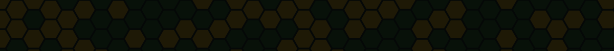
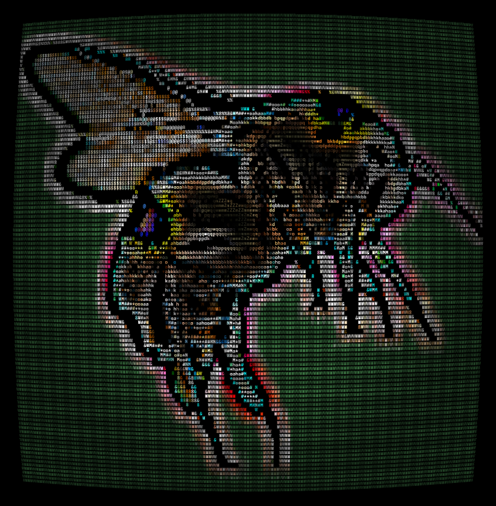
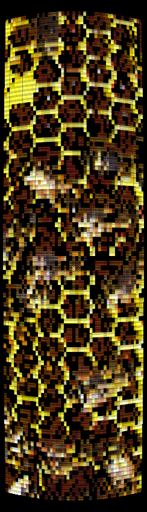
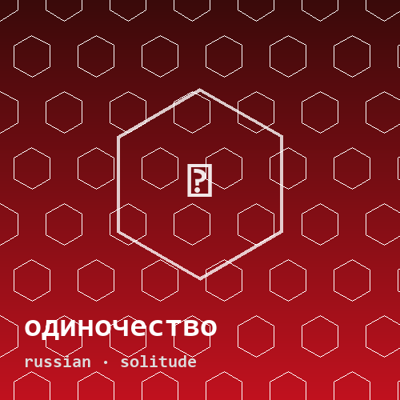
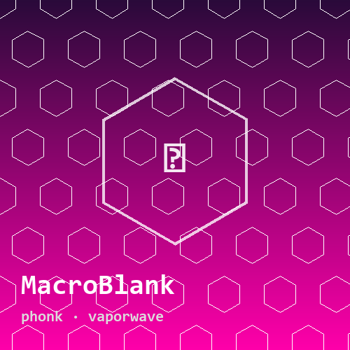
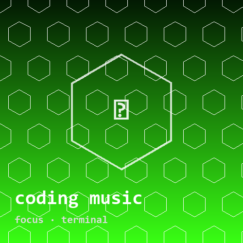
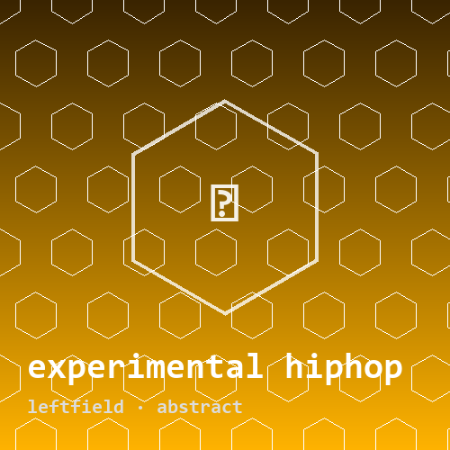
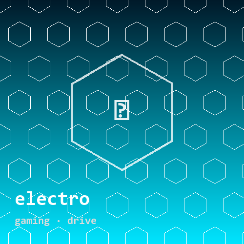
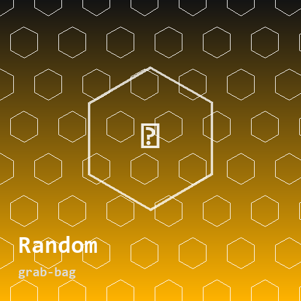

<table align="center"><tr>
<td valign="top"></td>
<td valign="top" width="720">

<code>§ 02 · IDENTITY</code>

<pre>
&gt; whoami
we invented the borders, the dogma, the noise.
i'd rather build, learn, and look up.
there are asteroids to mine, a hive to tend.
</pre>

<code>§ 03 · MANIFESTO — the invisible walls</code>

countries, dogma, illogical judgment, the default render of reality... none of it is real. mostly questions. some code. learning out loud. <i>particles · hives · cosmos · the chaos we're in.</i>

</td>
<td valign="top"></td>
</tr></table>

<code>§ 04 · ARSENAL</code>

<code>+ reverse-engineering · sec · game-modding</code>

<code>§ 05 · SIGNALS</code>

<code>§ 06 · FREQUENCIES — what's in my ears</code>

<table><tr>
<td align="center"><a href="https://music.youtube.com/playlist?list=PLvwLHgkB3k2HvjDlyNGkPk59j-7FIo2ou"> одиночество</a></td>
<td align="center"><a href="https://music.youtube.com/playlist?list=PLvwLHgkB3k2FP425gSzx7o6BlEQ3T9sLm"> MacroBlank</a></td>
<td align="center"><a href="https://music.youtube.com/playlist?list=PLvwLHgkB3k2EAYB-X6f59dXzzdBxEvEwg"> coding music</a></td>
</tr><tr>
<td align="center"><a href="https://music.youtube.com/playlist?list=PLvwLHgkB3k2HItVmSzrbI_8jhCkPqzvDn"> experimental hiphop</a></td>
<td align="center"><a href="https://music.youtube.com/playlist?list=PLvwLHgkB3k2GYdTD1KB-btF9-fIWTf8e2"> electro</a></td>
<td align="center"><a href="https://music.youtube.com/playlist?list=PLvwLHgkB3k2EnYSCBRHH8ywIK66yzOXVT"> Random</a></td>
</tr></table>

