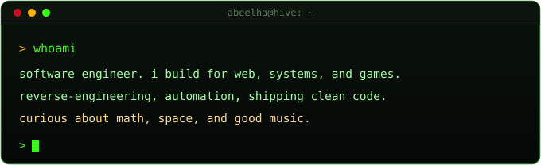
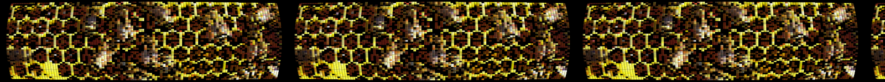
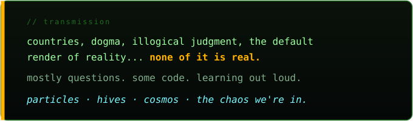

 

 

 

 

 

 

<code>+ reverse-engineering · sec · game-modding</code>

 

<table><tr>
<td align="center"><a href="https://music.youtube.com/playlist?list=PLvwLHgkB3k2HvjDlyNGkPk59j-7FIo2ou"> одиночество</a></td>
<td align="center"><a href="https://music.youtube.com/playlist?list=PLvwLHgkB3k2FP425gSzx7o6BlEQ3T9sLm"> MacroBlank</a></td>
<td align="center"><a href="https://music.youtube.com/playlist?list=PLvwLHgkB3k2EAYB-X6f59dXzzdBxEvEwg"> coding music</a></td>
</tr><tr>
<td align="center"><a href="https://music.youtube.com/playlist?list=PLvwLHgkB3k2HItVmSzrbI_8jhCkPqzvDn"> experimental hiphop</a></td>
<td align="center"><a href="https://music.youtube.com/playlist?list=PLvwLHgkB3k2GYdTD1KB-btF9-fIWTf8e2"> electro</a></td>
<td align="center"><a href="https://music.youtube.com/playlist?list=PLvwLHgkB3k2EnYSCBRHH8ywIK66yzOXVT"> Random</a></td>
</tr></table>

  

<table><tr>
<td align="center"></td>
<td align="center"></td>
<td align="center"></td>
</tr><tr>
<td align="center"></td>
<td align="center"></td>
<td align="center"></td>
</tr></table>

<code>build · learn · reach higher</code>

 

